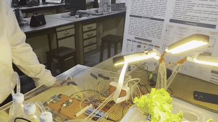
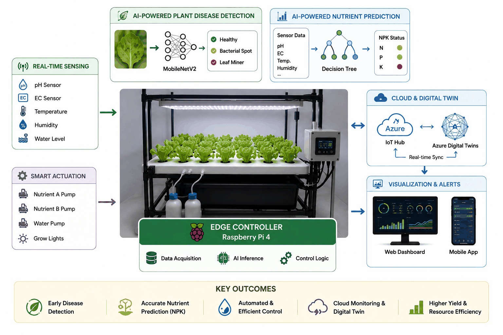
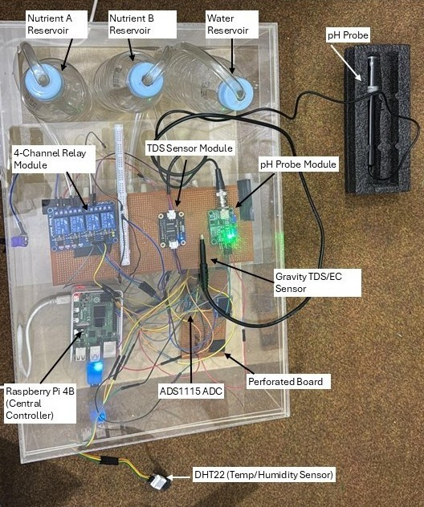
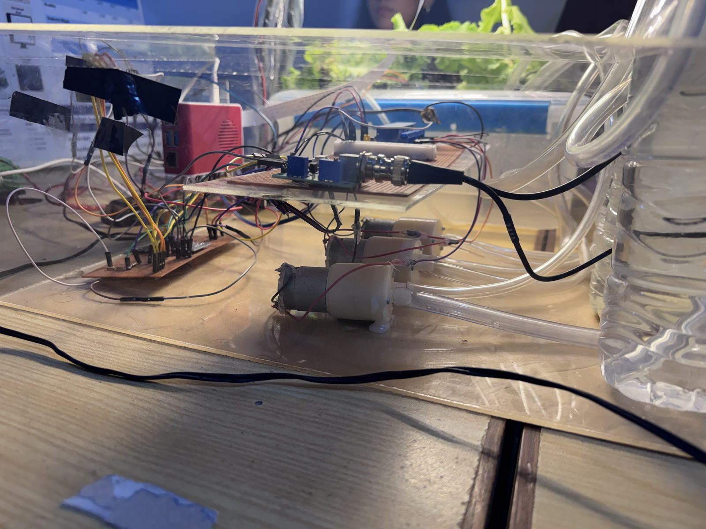
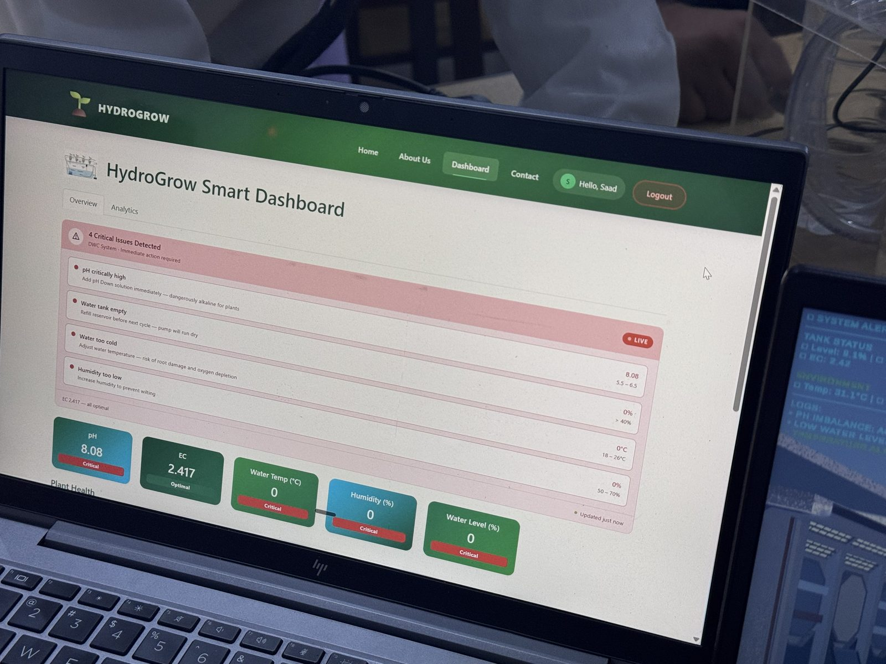
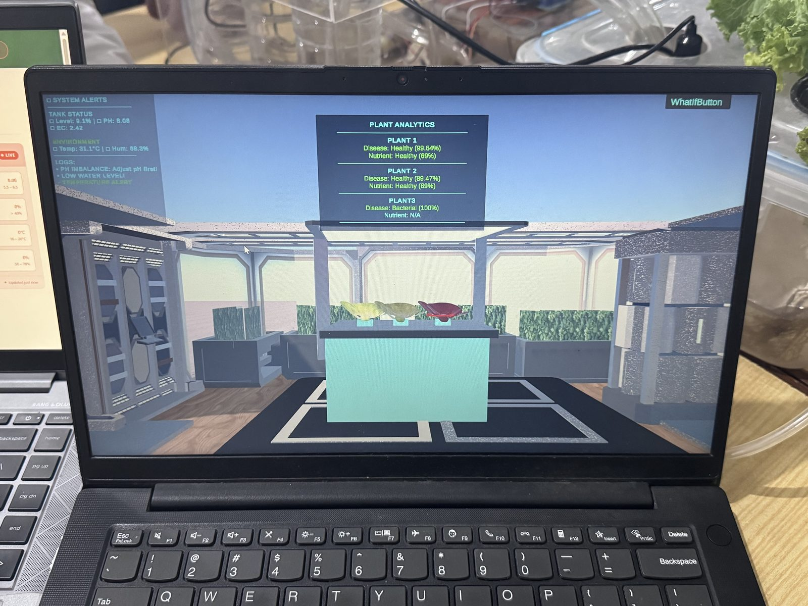

# HydroGrow

**A hydroponic lettuce farm that senses, decides, and doses itself.**

Raspberry Pi reads pH, EC, temperature, humidity and water level every 15 seconds.
Two ML models run on-device: one classifies leaf disease from camera frames, one
predicts nutrient deficiency from sensor state. The Pi acts on those predictions
by firing dosing pumps, then streams everything to Azure IoT Hub, a Digital Twin,
and a live dashboard.

Built, wired, calibrated, and run through a full 40-day grow cycle.

[Architecture](docs/architecture.md) · [Results](docs/results.md) · [Hardware](docs/hardware.md) · [Dosing logic](docs/dosing-logic.md)



## What it does

- **Senses.** Five sensor channels through an ADS1115 ADC and Pi GPIO, sampled on a 15 second loop.
- **Decides.** A GradientBoosting classifier maps live sensor state to a nutrient
  deficiency class. A MobileNetV2 classifier scores three plant regions from a single
  camera frame for bacterial infection and Septoria blight.
- **Acts.** Three peristaltic pumps dose macronutrients, micronutrients, and water.
  Dosing is gated on EC, model confidence, and growth phase. Nutrients dose before
  water top-up so concentration lands correctly.
- **Reports.** Telemetry goes Pi to IoT Hub to Azure Function to Blob Storage to
  Express API to React dashboard, and in parallel into an Azure Digital Twin that a
  Unity 3D scene mirrors in real time.

The dosing loop is the part that matters. Most hydroponic IoT projects are
dashboards with sensors attached. This one closes the loop and moves liquid.

## Architecture



| Layer | Stack | Responsibility |
|---|---|---|
| Edge | Raspberry Pi 4B, Python | Sensor reads, ML inference, pump control, OLED status |
| Transport | Azure IoT Hub, MQTT over TLS 8883 | Device auth and message ingestion |
| Processing | Azure Functions (Python) | Telemetry persistence, analytics API |
| Storage | Azure Blob Storage | Timestamped JSON per reading |
| Twin | Azure Digital Twins | Live model of tank, environment, and each plant |
| API | Node 20, Express | Serves the SPA, proxies analytics, exposes /pidata |
| UI | React | Live cards, trend charts, per-plant health with confidence bars |
| Visualization | Unity 3D | 3D twin driven off the Digital Twins graph |

Full hop-by-hop breakdown: [docs/architecture.md](docs/architecture.md)

## Results

### Leaf disease classifier

MobileNetV2 transfer learning, 15 epochs. One camera frame is cropped into three
fixed regions and scored independently, so a single Pi Camera covers three plants.

Held-out test set: 569 images.

| Class | Precision | Recall | F1 | Support |
|---|---|---|---|---|
| Bacterial | 0.93 | 0.92 | 0.92 | 172 |
| Healthy | 1.00 | 0.96 | 0.98 | 224 |
| Septoria blight | 0.92 | 0.98 | 0.95 | 173 |

**Overall accuracy 95.25%** · Macro F1 0.9501 · Weighted F1 0.9528

Classes are near-balanced (172 / 224 / 173), so overall accuracy is not masking a
majority-class effect. Precision of 1.00 on Healthy with recall 0.96 means the
model never calls a diseased plant healthy but occasionally flags a healthy one,
which is the correct direction to err for an actuating system.

Confusion matrix and training curves are generated by the notebook but not yet
exported into the repo; see [docs/results.md](docs/results.md).

### Nutrient deficiency classifier

Predicts Healthy / Nitrogen / Phosphorus / Potassium deficient from sensor
features. Stratified 80/20 split, 48-sample test set.

| Model | Accuracy | Weighted F1 |
|---|---|---|
| Gradient Boosting (shipped) | 97.92% | 0.9788 |
| Random Forest | 97.92% | 0.9788 |
| SVM (RBF) | 97.92% | 0.9788 |
| Decision Tree | 95.83% | 0.9583 |
| KNN | 89.58% | 0.8932 |

Per-class on the shipped model: Healthy 1.00 F1, Phosphorus 1.00, Potassium 0.94,
Nitrogen 0.91. Nitrogen recall (0.83) is the weak point, one of six nitrogen
samples is misread as potassium deficient.

**Methodology note.** Training data is a 240-row simulated dataset (60 days x 4
plants) built to match physical sensor ranges and realistic deficiency dynamics.
It is not field-labelled. Because rows are consecutive days from the same plants,
a random split places adjacent days from one plant on both sides of the split, so
these figures should be read as an upper bound rather than a clean generalization
estimate. Grouped cross validation by plant lands closer to 95%. Notebook and
dataset assumptions: [ml/nutrient-prediction/](ml/nutrient-prediction/)

### On-device performance

Not yet measured on the Pi; see the Roadmap.

## Hardware





Full BOM, pinout, and the wiring lessons (relay drive current, ultrasonic
inversion, ECHO divider): [docs/hardware.md](docs/hardware.md)

## Dashboard



Live sensor cards and alerting, viewed mid-grow-cycle.

## Digital Twin



Per-plant disease and nutrient status over live tank telemetry, mid-session.

## Quickstart

### Run on a Raspberry Pi

```bash
git clone https://github.com/Mr-Engnr/hydrogrow.git
cd hydrogrow
python -m venv .venv && source .venv/bin/activate
pip install -r firmware/requirements.txt
cp firmware/config/settings.example.yaml firmware/config/settings.yaml
python firmware/tests/test_hardware_full.py  # bring-up: verify each sensor/pump
python firmware/main.py
```

### Run the dashboard and API

```bash
cp .env.example .env
docker compose up
```

Dashboard on http://localhost:3000, API on :8080.

## Repo map

| Path | What lives here |
|---|---|
| firmware/ | Pi control loop, sensor drivers, dosing logic, on-device inference |
| ml/ | Training notebooks, trained nutrient model |
| cloud/ | Azure Functions, Digital Twin models, provisioning scripts |
| backend/ | Express API and static host |
| dashboard/ | React SPA |
| docs/ | Architecture, hardware, calibration, dosing math, deployment, results |
| media/ | Photos, diagrams, dashboard and twin captures |

## Roadmap

- [ ] Hardware-free mock mode for the control loop
- [ ] On-device latency benchmarks on Raspberry Pi
- [ ] Growth-cycle photo timeline from the next grow run
- [ ] Two-point pH calibration on a scheduled cadence, drift logged as telemetry
- [ ] Volume-based dosing using measured pump flow rate
- [ ] Retrain the disease model on images captured by this rig
- [ ] Persist users in a real database instead of a file store
- [ ] Closed-loop pH correction with an up/down dosing pair

## Known limits

- Nutrient model trains on simulated data. See the note in Results.
- Auth is random opaque bearer tokens stored server-side, with a file-backed
  user store: single-operator grade, not multi-tenant.
- Dosing is time-based; accuracy depends on pump flow staying stable.
- The original Azure deployment ran on a now-retired subscription. Everything is
  reproducible on any subscription following the runbook in
  [docs/deployment.md](docs/deployment.md); media/ shows the system live.

## Credits

Built by Rana Saad Safdar - hardware, firmware, ML, cloud, backend, dashboard.

## License

Apache 2.0. See [LICENSE](LICENSE).
